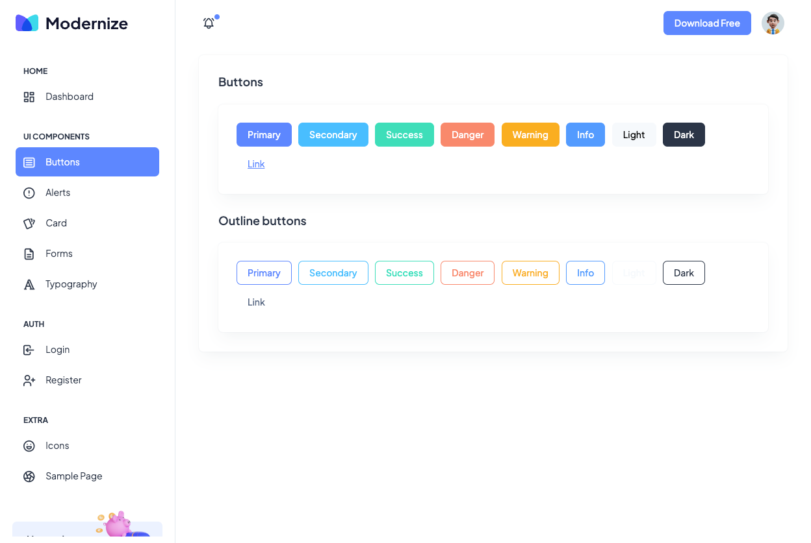
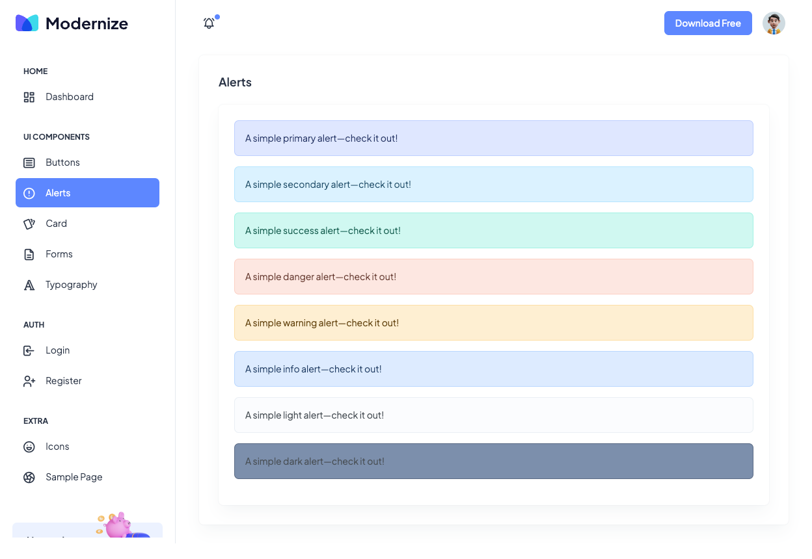
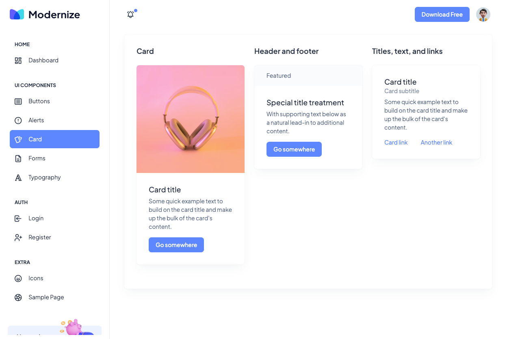
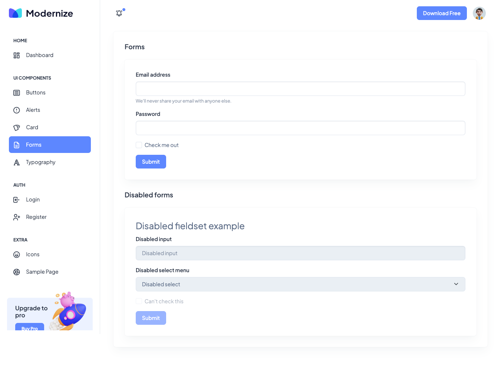
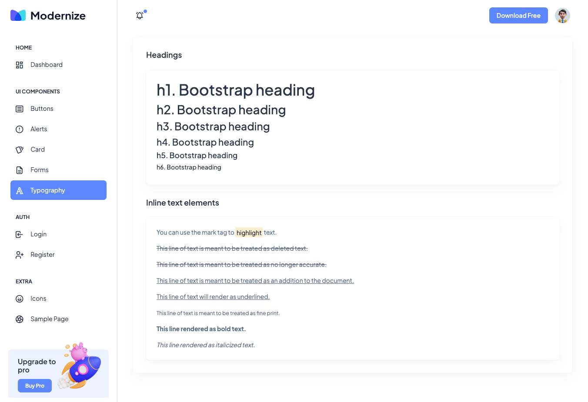
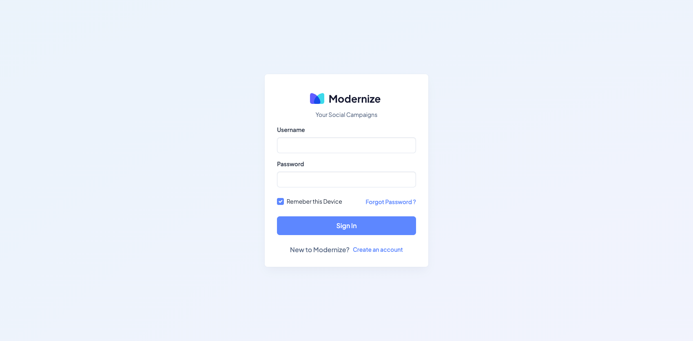
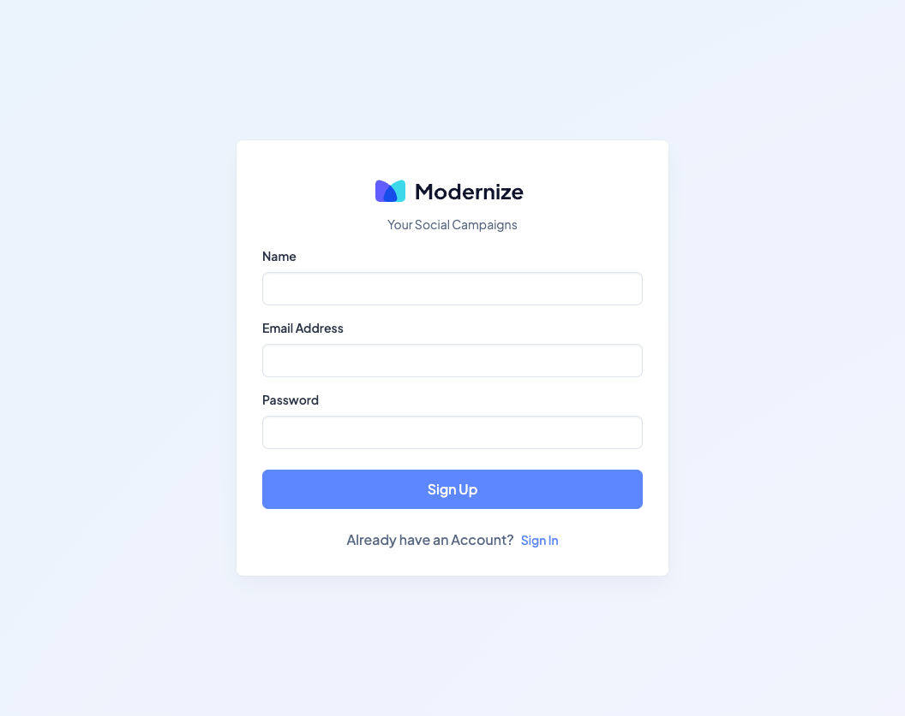
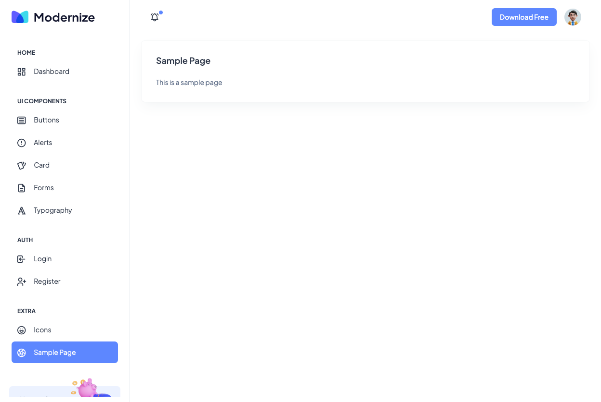
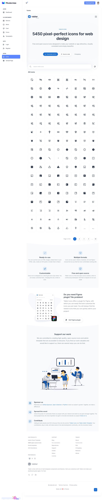

# Spring Boot with Modernize Template

### Things todo list

1. Clone this repository: `git clone https://github.com/anugerahramadanii/springboot-modernize-template.git`
2. Navigate to the folder: `cd springboot-modernize-template`
3. Run the application: `mvn clean spring-boot:run`
4. Open your favorite browser: http://localhost:8080

### Image Screenshots

Dashboard Page

UI Button Page

UI Alert Page

UI Card Page

UI Form Page

UI Typography Page

Login Page

Register Page

Sample Page

Icons Page

